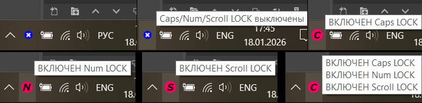

`# CAPSLogger - отображение в трее состояния Caps/Num/Scroll Lock`

  
*Интерфейс CAPSLogger для разных состояний*


## Требования
  - Windows (тестировано на Windows 10)
  - MASM32 (для сборки)

## Описание

CAPSLogger позволяет отслеживать активность функций кнопок Caps Lock, Num Lock и Scroll Lock. При включении той или иной функции иконка программы в трее меняется сигнализируя о состоянии одной или нескольких функциональных кнопок. При наведении на иконку программы появляется всплывающее сообщение с текущими состояниями функций кнопок.

Данный проект CAPSLogger возник во времена моего студенчества на фоне самостоятельного изучения языка Assembly и WinAPI. Из-за потребности близкого мне человека знать о включенном или выключенном состоянии клавиши Caps Lock было решено написать простую утилиту для Windows, которая будет отображать эту информацию.

## Содержимое репозитория

```
CAPSLogger/
├── README.MD
├── LICENSE
├── .gitignore
├── build/
│   ├── 1_Assemble.bat
│   ├── 2_Link.bat
│   ├── 3_Debug_OllyDbg.bat
│   └── 3_Debug_TD32.bat
├── docs/
│   └── screenshot.png
├── src/
│   ├── CAPSLogger.asm
│   ├── TrayStatusChange.asm
│   └── macro.inc
└── res/
    ├── resources.rc
    ├── resources.inc
    ├── CAPS.ICO
    ├── NO.ICO
    ├── NUM.ICO
    └── SCROLL.ICO
```

## Инструкция по сборке

1. Предварительно проверьте что MASM32 установлен в корень диска C:\\. Если это не так измените переменую MASM32_DIR в ".\build\1_Assemble.bat", ".\build\2_Link.bat" в соответствии с вашей конфигурацией.

2. Запустите "./build/1_Assemble.bat". В случае успешного ассемблирования должно появится сообщение в командной строке: "[+] Step 1 completed successfully."

3. После успешного выполнения предыдущего шага запустите "./build/2_Link.bat". В случае успешной линковки должно появится сообщение в командной строке: "[+] Successfully linked: bin\CAPSLogger.exe"

4. После успешного выполнения предыдущего шага итоговый файл программы готовый к использованию будет лежать в вашем локальном репозитории по пути ".\bin\CAPSLogger.exe"


# Ограничения и примечания:
  - Программа создает мьютекс при запуске, что препятствует запуску её дублирующих копий. После закрытия приложения мьютекс будет автоматически освобожден системой.
  - Результатом сборки являются две директории и их содержимое: ".\obj\" и ".\bin\".
  - В случае научного интереса можно воспользоваться дебаггером TD32 (Turbo Debugger), OllyDbg либо любым другим удобным. Для первых двух предусмотрены bat-файлы для быстрого запуска ".\build\3_Debug_TD32.bat" и ".\build\3_Debug_OllyDbg.bat" соответственно.
  - Программа при первом запуске может "скрыться". Для постоянной видимости в трее достаточно единожды поместить перетаскиванием её значка из панели скрытых обратно на системный трей.
  - При постоянном использовании программы удобно разместить её в системной директории (например, C:\Program Files\CAPSLogger\CAPSLogger.exe\) и добавить в автозагрузку (путем создания и выполнения файла с расширением .reg)
    - Для всех пользователей
      ```reg
		Windows Registry Editor Version 5.00
      
		[HKEY_LOCAL_MACHINE\SOFTWARE\Microsoft\Windows\CurrentVersion\Run]
		"CAPSLog"="\"C:\\Program Files\\CAPSLogger\\CAPSLogger.exe\""
      ```
    - Только для текущего
      ```reg
		Windows Registry Editor Version 5.00
      
		[HKEY_CURRENT_USER\SOFTWARE\Microsoft\Windows\CurrentVersion\Run]
		"CAPSLog"="\"C:\\Program Files\\CAPSLogger\\CAPSLogger.exe\""
      ```

# Лицензия
  - Распространяется под лицензией [MIT](LICENSE).

